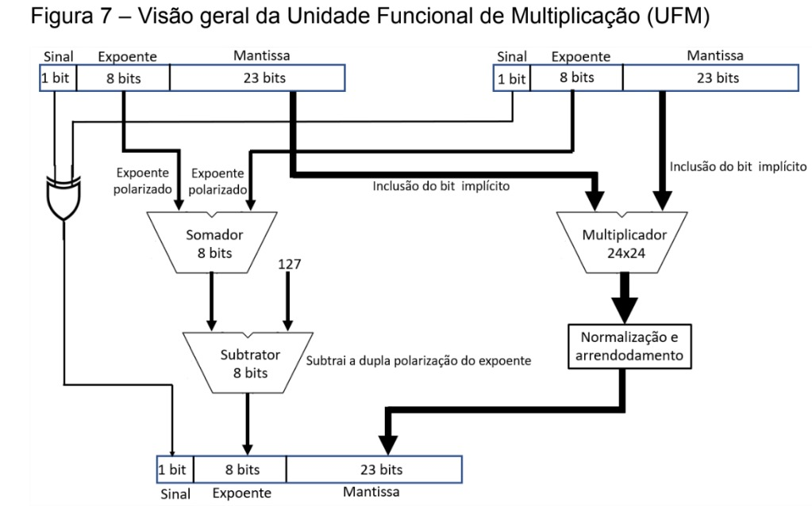

# FPU Multiplier — `fpu_mult_top`

## Descrição Geral

O módulo `fpu_mult_top` implementa a unidade funcional responsável pela
multiplicação em ponto flutuante da FPU.

A arquitetura utiliza como referência o formato IEEE 754 de precisão simples,
no qual cada operando é composto por 32 bits distribuídos em três campos:

| Campo | Largura |
|---|---:|  
| Sinal | 1 bit |
| Expoente | 8 bits |
| Mantissa | 23 bits |
| **Total** | **32 bits** |

Os campos dos dois operandos são recebidos separadamente pelo módulo principal
e distribuídos entre subsistemas especializados.

O processamento é dividido entre:

- cálculo do sinal;
- cálculo do expoente;
- reconstrução e multiplicação dos significandos;
- normalização do produto;
- geração dos bits Guard, Round e Sticky;
- detecção de overflow e underflow;
- montagem do resultado final.

O resultado é novamente organizado em uma palavra de 32 bits no formato:

`Sinal | Expoente | Mantissa`

---

## Referência da Arquitetura

A organização funcional utilizada como referência para a implementação é
apresentada abaixo:



A implementação divide o processamento da multiplicação em caminhos
independentes para sinal, expoente e mantissa.

Esses caminhos são reunidos novamente no módulo `fpu_mult_top` para composição
do resultado final.

---

# Interface do Módulo

## Entradas

| Sinal | Largura | Descrição |
|---|---:|---|
| `clk` | 1 bit | Clock do circuito |
| `rst` | 1 bit | Reset assíncrono ativo em nível baixo |
| `op` | 2 bits | Código da operação selecionada |
| `a_s` | 1 bit | Bit de sinal do operando A |
| `b_s` | 1 bit | Bit de sinal do operando B |
| `a_e` | 8 bits | Campo de expoente do operando A |
| `b_e` | 8 bits | Campo de expoente do operando B |
| `a_m` | 23 bits | Campo de mantissa do operando A |
| `b_m` | 23 bits | Campo de mantissa do operando B |

---

## Saídas

| Sinal | Largura | Descrição |
|---|---:|---|
| `result` | 32 bits | Resultado final da multiplicação |
| `done` | 1 bit | Indica que o produto da mantissa foi disponibilizado |
| `guard` | 1 bit | Bit Guard obtido durante a normalização |
| `round` | 1 bit | Bit Round obtido durante a normalização |
| `sticky` | 1 bit | Indica presença de bits descartados de menor peso |
| `overflow` | 1 bit | Indica estouro positivo da faixa do expoente |
| `underflow` | 1 bit | Indica resultado abaixo da faixa tratada pelo expoente |

---

# Parâmetros

A arquitetura utiliza parâmetros para controlar as larguras dos campos
internos.

| Parâmetro | Valor padrão | Descrição |
|---|---:|---|
| `WIDTH` | 24 | Largura do significando incluindo o bit implícito |
| `T_WID` | 23 | Índice derivado de `WIDTH` |
| `I_WID` | 22 | Índice máximo da mantissa armazenada |
| `R_WID` | 47 | Índice máximo do produto de 48 bits |
| `EXP_WID` | 8 | Largura do campo de expoente |
| `E_WID` | 7 | Índice máximo do campo de expoente |
| `F_WID` | 31 | Índice máximo do resultado de 32 bits |

Com os parâmetros padrão, a unidade trabalha com campos compatíveis com
operandos IEEE 754 de precisão simples.

---

# Organização Geral

O `fpu_mult_top` integra quatro subsistemas principais:

- `fpu_mult_24x24`
- `fpu_mult_exp_calc`
- `fpu_mult_norm`
- `fpu_mult_signal`

A organização funcional pode ser representada por:

```text
                    OPERANDO A                    OPERANDO B
                 ┌──────────────┐              ┌──────────────┐
                 │ S │ E │ M    │              │ S │ E │ M    │
                 └─┬───┬───┬────┘              └─┬───┬───┬────┘
                   │   │   │                     │   │   │
                   │   │   │                     │   │   │
                   │   │   └──────────┐   ┌──────┘   │   │
                   │   │              │   │          │   │
                   │   │              ▼   ▼          │   │
                   │   │         ┌──────────────┐     │   │
                   │   │         │ mult 24x24   │     │   │
                   │   │         └──────┬───────┘     │   │
                   │   │                │             │   │
                   │   │                │ produto     │   │
                   │   │                │ 48 bits     │   │
                   │   │                ▼             │   │
                   │   │         ┌──────────────┐     │   │
                   │   │         │ normalização │     │   │
                   │   │         └──────┬───────┘     │   │
                   │   │                │             │   │
                   │   │                ├── mantissa  │   │
                   │   │                ├── GRS       │   │
                   │   │                │             │   │
                   │   │                └── ajuste ───┐   │
                   │   │                              │   │
                   │   └──────────────────────┐       │   │
                   │                          ▼       │   │
                   │                   ┌──────────────┐│   │
                   │                   │ exp_calc     │◄───┘
                   │                   └──────┬───────┘
                   │                          │
                   │                          │ expoente
                   │                          │
                   └───────┐          ┌───────┘
                           ▼          ▼
                     ┌────────────────────┐
                     │ composição final   │
                     │ Sinal              │
                     │ Expoente           │
                     │ Mantissa           │
                     └─────────┬──────────┘
                               │
                               ▼
                         result[31:0]
```

---

# 1. Subsistema de Multiplicação das Mantissas

## `fpu_mult_24x24`

O módulo `fpu_mult_24x24` é responsável por reconstruir os significandos dos
operandos e realizar sua multiplicação.

No formato IEEE 754 de precisão simples, números normalizados possuem um bit
implícito igual a `1`.

Esse bit não é armazenado fisicamente dentro dos 23 bits do campo de mantissa.

Dessa forma, uma mantissa recebida como:

`mantissa[22:0]`

representa efetivamente:

`1.mantissa`

Antes da multiplicação, o módulo adiciona esse bit implícito aos dois operandos.

Assim:

```text
Mantissa A: 23 bits
       ↓
Significando A: 24 bits

Mantissa B: 23 bits
       ↓
Significando B: 24 bits
```

A operação realizada passa então a ser:

```text
24 bits × 24 bits = 48 bits
```

O produto de 48 bits contém toda a precisão intermediária necessária para que a
etapa seguinte determine:

- a mantissa normalizada;
- a necessidade de ajuste do expoente;
- os bits Guard;
- Round;
- Sticky.

---

## Seleção da operação

O módulo recebe o sinal `op`, utilizado para determinar quando a multiplicação
deve ser considerada ativa.

Os códigos utilizados são:

| `op` | Operação |
|---|---|
| `00` | ADD |
| `01` | SUB |
| `10` | MUL |
| `11` | Reservado |

Para o multiplicador, a operação válida ocorre quando:

`op = 2'b10`

Quando a multiplicação está selecionada, o produto calculado é registrado e o
sinal `done` é ativado.

Nas demais operações, o caminho de multiplicação não disponibiliza um produto
válido.

---

## Sinal `done`

O sinal `done` indica que o resultado interno da multiplicação das mantissas
está disponível.

Ele permite que o restante da arquitetura ou a bancada de verificação
identifique o momento em que o produto foi calculado.

O sinal está diretamente associado ao processamento realizado pelo
`fpu_mult_24x24`.

---

# 2. Subsistema de Normalização

## `fpu_mult_norm`

O módulo `fpu_mult_norm` recebe o produto completo de 48 bits gerado pela
multiplicação dos significandos.

Como os operandos normalizados possuem significandos dentro da faixa:

```text
1 <= significando < 2
```

o produto pode assumir valores na faixa:

```text
1 <= produto < 4
```

Portanto, existem duas formas principais de resultado.

### Produto já normalizado

Exemplo:

```text
1.01 × 1.10 = 1.xxxxx
```

Nesse caso, o resultado já possui a forma:

```text
1.xxxxx
```

e pode ser utilizado diretamente como base para a mantissa final.

---

### Produto que necessita normalização

Também pode ocorrer:

```text
1.xxxx × 1.xxxx = 10.xxxxx
```

ou:

```text
11.xxxxx
```

Nesse caso, o produto possui um bit adicional à esquerda.

O significando precisa então ser deslocado uma posição para a direita.

Por exemplo:

```text
10.01 × 2^E
```

é transformado em:

```text
1.001 × 2^(E+1)
```

Esse deslocamento possui duas consequências:

1. altera a região do produto que será utilizada como mantissa;
2. exige que o expoente seja incrementado em uma unidade.

---

# Detecção da necessidade de normalização

O módulo utiliza o bit mais significativo do produto de 48 bits para determinar
qual situação ocorreu.

Quando esse bit está em `0`, o significando está na faixa esperada sem
necessidade de incremento do expoente.

Quando está em `1`, o produto deve ser deslocado uma posição adicional e o
expoente deve receber uma correção de `+1`.

Essa informação forma o sinal de ajuste da normalização, utilizado também pelo
subsistema de cálculo de expoente.

Conceitualmente:

```text
MSB do produto = 0
        ↓
ajuste do expoente = 0

MSB do produto = 1
        ↓
ajuste do expoente = 1
```

---

# Extração da mantissa

O produto intermediário possui 48 bits, mas o resultado IEEE 754 possui apenas
23 bits armazenados no campo de mantissa.

O normalizador seleciona a região apropriada do produto conforme a posição do
bit mais significativo.

O bit implícito da representação normalizada não é armazenado no resultado
final.

Dessa forma, após a normalização:

```text
1.xxxxxxxxxxxxxxxxxxxxxxx
  └───────── 23 bits ─────────┘
```

somente os bits após o `1` implícito são encaminhados como mantissa final.

---

# 3. Bits Guard, Round e Sticky

Durante a redução do produto de 48 bits para a mantissa final de 23 bits,
diversos bits menos significativos precisam ser descartados.

Esses bits ainda contêm informação sobre a precisão do resultado.

Para preservar parte dessa informação, o normalizador produz os sinais:

- `guard`;
- `round`;
- `sticky`.

Esses sinais são normalmente chamados de bits **GRS**.

---

## Guard

O bit `guard` é o primeiro bit imediatamente após o último bit mantido na
mantissa.

Representação conceitual:

```text
Mantissa mantida | G | R | demais bits
                 ↑
               Guard
```

Ele representa o primeiro bit perdido durante a redução de precisão.

---

## Round

O bit `round` é o bit imediatamente posterior ao Guard.

```text
Mantissa mantida | G | R | demais bits
                     ↑
                   Round
```

Ele fornece informação adicional sobre a parte fracionária descartada.

---

## Sticky

O bit `sticky` representa o OR lógico de todos os demais bits descartados.

Conceitualmente:

```text
Sticky = bit0 OR bit1 OR bit2 OR ... OR bitN
```

Assim:

```text
sticky = 0
```

significa que todos os bits restantes descartados eram zero.

Enquanto:

```text
sticky = 1
```

indica que pelo menos um bit descartado possuía valor `1`.

---

## Utilização dos sinais GRS

Os sinais Guard, Round e Sticky permitem que uma etapa de arredondamento
determine se a mantissa deve ser incrementada.

A unidade atual disponibiliza esses sinais externamente para utilização pelas
etapas subsequentes da FPU.

---

# 4. Subsistema de Cálculo do Expoente

## `fpu_mult_exp_calc`

O módulo `fpu_mult_exp_calc` calcula o expoente correspondente ao produto.

No formato IEEE 754, o expoente armazenado não representa diretamente o
expoente matemático do número.

Ele utiliza uma representação polarizada por um valor denominado **Bias**.

Para precisão simples:

```text
Bias = 127
```

Assim, o expoente real é relacionado ao expoente armazenado por:

```text
Ereal = Earmazenado - 127
```

---

## Multiplicação de números em ponto flutuante

Considere dois números:

```text
A = MA × 2^EA
B = MB × 2^EB
```

A multiplicação é:

```text
A × B = (MA × MB) × 2^(EA + EB)
```

Portanto, os expoentes reais devem ser somados.

Como os dois expoentes recebidos já incluem o Bias, é necessário remover uma
das polarizações após a soma.

O cálculo básico é:

```text
Eresultado = EA + EB - Bias
```

Para precisão simples:

```text
Eresultado = EA + EB - 127
```

---

# Ajuste decorrente da normalização

O cálculo do expoente também recebe a informação proveniente da normalização da
mantissa.

Caso o produto das mantissas possua a forma:

```text
10.xxxxx
```

ele é convertido para:

```text
1.xxxxx × 2^1
```

Portanto, o expoente precisa ser incrementado.

A equação completa utilizada pelo subsistema passa a ser:

```text
Eresultado = EA + EB - 127 + ajuste_normalização
```

onde:

```text
ajuste_normalização = 0
```

quando o produto não necessita do deslocamento adicional;

e:

```text
ajuste_normalização = 1
```

quando a normalização desloca o significando uma posição para a direita.

---

## Exemplo sem ajuste de normalização

Para:

```text
1.0 × 2.0
```

os expoentes armazenados são:

```text
1.0 → 127
2.0 → 128
```

Então:

```text
127 + 128 - 127 = 128
```

Como o produto das mantissas não exige incremento adicional:

```text
ajuste_normalização = 0
```

logo:

```text
Eresultado = 128
```

que corresponde ao expoente de `2.0`.

---

## Exemplo com ajuste de normalização

Para:

```text
1.5 × 1.5
```

os expoentes armazenados são:

```text
127 e 127
```

O cálculo inicial seria:

```text
127 + 127 - 127 = 127
```

Entretanto:

```text
1.1₂ × 1.1₂ = 10.01₂
```

O produto deve ser normalizado:

```text
10.01₂ = 1.001₂ × 2¹
```

Logo:

```text
ajuste_normalização = 1
```

e:

```text
127 + 127 - 127 + 1 = 128
```

Com isso, o resultado representa corretamente:

```text
1.001₂ × 2¹ = 2.25
```

---

# Representação interna do cálculo do expoente

Os campos de expoente recebidos da representação IEEE 754 são valores sem sinal.

Entretanto, o resultado intermediário do cálculo pode ultrapassar a faixa
representável ou ficar abaixo de zero.

Por esse motivo, o subsistema utiliza internamente uma representação com sinal
e largura superior à dos expoentes de entrada.

Essa largura adicional permite representar corretamente:

- resultados positivos válidos;
- resultados acima da faixa;
- resultados negativos;
- condições de overflow;
- condições de underflow.

Os expoentes de entrada são estendidos preservando sua interpretação como
valores positivos antes de participar da aritmética com sinal.

---

# 5. Overflow

O sinal `overflow` indica que o expoente resultante ultrapassou a maior faixa
normal tratada pela unidade.

Para números normalizados em precisão simples, o maior expoente armazenado
utilizado para valores finitos é:

```text
254
```

O padrão:

```text
255
```

é reservado pelo IEEE 754 para representações especiais como infinito e NaN.

Assim, quando o cálculo produz:

```text
Eresultado > 254
```

o subsistema sinaliza:

```text
overflow = 1
```

Caso contrário:

```text
overflow = 0
```

---

# 6. Underflow

O sinal `underflow` indica que o expoente calculado ficou abaixo da faixa
normal tratada pela unidade.

Quando:

```text
Eresultado <= 0
```

o resultado deixa a faixa de representação normal considerada pelo bloco.

Nessa condição:

```text
underflow = 1
```

Caso contrário:

```text
underflow = 0
```

O tratamento completo de números subnormais pode ser realizado por uma etapa
específica da FPU caso essa funcionalidade seja implementada na arquitetura.

---

# 7. Subsistema de Sinal

## `fpu_mult_signal`

O sinal do resultado de uma multiplicação depende exclusivamente dos sinais dos
dois operandos.

A regra é equivalente a uma operação XOR.

| Sinal A | Sinal B | Resultado |
|---:|---:|---:|
| 0 | 0 | 0 |
| 0 | 1 | 1 |
| 1 | 0 | 1 |
| 1 | 1 | 0 |

Portanto:

```text
sinal_resultado = sinal_A XOR sinal_B
```

Operandos com sinais iguais produzem um resultado positivo.

Operandos com sinais diferentes produzem um resultado negativo.

---

## Exemplos

```text
(+A) × (+B) = +R
```

```text
(-A) × (-B) = +R
```

```text
(+A) × (-B) = -R
```

```text
(-A) × (+B) = -R
```

Esse processamento é independente dos cálculos de expoente e mantissa.

---

# 8. Integração no `fpu_mult_top`

O módulo `fpu_mult_top` atua como ponto de integração entre todos os
subsistemas.

Os campos de entrada são distribuídos da seguinte forma:

```text
a_s, b_s
    │
    ▼
fpu_mult_signal
    │
    ▼
sinal final
```

```text
a_e, b_e
    │
    ▼
fpu_mult_exp_calc
    │
    ▼
expoente final
```

```text
a_m, b_m
    │
    ▼
fpu_mult_24x24
    │
    ▼
produto de 48 bits
    │
    ▼
fpu_mult_norm
    │
    ├── mantissa
    ├── guard
    ├── round
    └── sticky
```

O produto das mantissas também fornece a informação necessária para determinar
se houve deslocamento adicional durante a normalização.

Essa informação é utilizada pelo cálculo do expoente.

---

# 9. Formação do Resultado

Após o processamento dos três campos, o resultado é montado através da
concatenação:

```text
{sinal, expoente, mantissa}
```

A distribuição final é:

```text
31          30                    23 22                     0
┌───────────┬──────────────────────┬────────────────────────┐
│   Sinal   │      Expoente        │       Mantissa         │
│   1 bit   │       8 bits         │        23 bits         │
└───────────┴──────────────────────┴────────────────────────┘
```

Assim:

```text
result[31]    = sinal
result[30:23] = expoente
result[22:0]  = mantissa
```

---

# 10. Fluxo Completo da Multiplicação

O fluxo de processamento pode ser dividido nas seguintes etapas.

## Etapa 1 — Recepção dos operandos

Os campos dos dois operandos são recebidos separadamente:

```text
A = sinal_A | expoente_A | mantissa_A
B = sinal_B | expoente_B | mantissa_B
```

---

## Etapa 2 — Determinação do sinal

Os bits de sinal são enviados para o `fpu_mult_signal`.

É realizada uma operação XOR:

```text
Sresultado = Sa XOR Sb
```

---

## Etapa 3 — Reconstrução dos significandos

O bit implícito `1` é acrescentado às mantissas:

```text
a_m → 1.a_m
b_m → 1.b_m
```

Cada significando passa a possuir 24 bits.

---

## Etapa 4 — Multiplicação das mantissas

Os dois significandos são multiplicados:

```text
24 × 24 → 48 bits
```

O resultado completo é preservado para as etapas seguintes.

---

## Etapa 5 — Cálculo inicial do expoente

Os expoentes dos operandos são somados e o Bias é removido:

```text
EA + EB - 127
```

---

## Etapa 6 — Análise da normalização

O produto das mantissas é analisado.

Se estiver na forma:

```text
1.xxxxx
```

não é necessário ajuste adicional do expoente.

Se estiver na forma:

```text
10.xxxxx
```

o significando é deslocado e o expoente recebe:

```text
+1
```

---

## Etapa 7 — Extração da mantissa

Após a escolha da posição correta do significando, os 23 bits correspondentes à
mantissa armazenável são selecionados.

O bit implícito é descartado.

---

## Etapa 8 — Geração de GRS

Os primeiros bits descartados são utilizados para formar:

```text
Guard
Round
Sticky
```

Esses sinais preservam informações necessárias para um tratamento posterior de
arredondamento.

---

## Etapa 9 — Verificação da faixa do expoente

O valor calculado é analisado para geração das condições:

```text
overflow
underflow
```

---

## Etapa 10 — Formação da palavra final

Os campos calculados são concatenados:

```text
S | E | M
```

produzindo:

```text
result[31:0]
```

---

# Exemplo: `1.0 × 2.0`

Os operandos são:

```text
1.0 = 0x3F800000
2.0 = 0x40000000
```

Os sinais são:

```text
0 XOR 0 = 0
```

Os significandos são:

```text
1.0 × 1.0 = 1.0
```

Os expoentes são:

```text
127 + 128 - 127 = 128
```

Não existe ajuste adicional de normalização:

```text
norm_inc = 0
```

Portanto:

```text
S = 0
E = 128
M = 0
```

O resultado é:

```text
0x40000000
```

correspondente a:

```text
2.0
```

---

# Exemplo: `-1.5 × -1.5`

Os operandos são:

```text
-1.5 = 0xBFC00000
-1.5 = 0xBFC00000
```

Os sinais são:

```text
1 XOR 1 = 0
```

portanto o resultado é positivo.

Os significandos são:

```text
1.1₂ × 1.1₂
```

resultando em:

```text
10.01₂
```

Esse valor precisa ser normalizado:

```text
10.01₂ → 1.001₂ × 2¹
```

Logo:

```text
norm_inc = 1
```

O cálculo do expoente é:

```text
127 + 127 - 127 + 1
```

resultando em:

```text
128
```

A mantissa normalizada representa:

```text
1.001₂
```

Assim, a palavra final é:

```text
0x40100000
```

correspondente a:

```text
2.25
```

---

# Arquivos Relacionados

| Arquivo | Função |
|---|---|
| `fpu_mult_top.v` | Integra os subsistemas da unidade de multiplicação |
| `fpu_mult_24x24.v` | Reconstrói e multiplica os significandos |
| `fpu_mult_exp_calc.v` | Calcula o expoente e gera overflow/underflow |
| `fpu_mult_norm.v` | Normaliza o produto e gera Guard, Round e Sticky |
| `fpu_mult_signal.v` | Determina o sinal do resultado |
| `referencia_de_projeto.jpg` | Referência visual da arquitetura |

---

# Resumo dos Subsistemas

| Subsistema | Entrada principal | Função | Saída principal |
|---|---|---|---|
| `fpu_mult_signal` | Sinais A e B | Determina o sinal do produto | Sinal |
| `fpu_mult_exp_calc` | Expoentes A e B + ajuste de normalização | Calcula o expoente | Expoente, overflow e underflow |
| `fpu_mult_24x24` | Mantissas A e B | Multiplica os significandos | Produto de 48 bits e `done` |
| `fpu_mult_norm` | Produto de 48 bits | Normaliza o significando | Mantissa e GRS |
| `fpu_mult_top` | Todos os campos | Integra os subsistemas | Resultado de 32 bits |

---

# Comportamento Esperado

Para uma operação de multiplicação válida, a unidade deve:

1. receber os campos dos dois operandos;
2. determinar o sinal através dos bits de sinal;
3. reconstruir os significandos adicionando o bit implícito;
4. multiplicar os significandos de 24 bits;
5. calcular o expoente inicial;
6. verificar a necessidade de normalização;
7. corrigir o expoente quando necessário;
8. selecionar a mantissa normalizada;
9. gerar Guard, Round e Sticky;
10. detectar overflow ou underflow;
11. formar o resultado de 32 bits;
12. indicar a disponibilidade da multiplicação através de `done`.

Com os parâmetros padrão, o resultado possui a organização:

```text
1 bit de sinal | 8 bits de expoente | 23 bits de mantissa
```

correspondente à estrutura utilizada pelo formato IEEE 754 de precisão simples.
